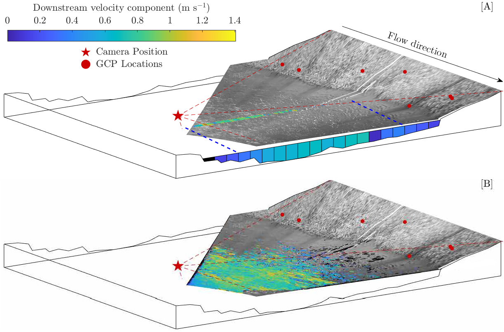

<h1 align="center"> Unsupervised image velocimetry for automated computation of river flow velocities </h1>

 

<!-- TABLE OF CONTENTS -->
<h2 id="table-of-contents"> :book: Table of Contents</h2>

  
Table of Contents

  <ol>
    <li><a href="#about-the-repository"> ➤ About The Repository</a></li>
    <li><a href="#prerequisites"> ➤ Prerequisites</a></li>
    <li><a href="#Repository Structure"> ➤ Repository Structure</a></li>
    <li><a href="#How to use"> ➤ How to use</a></li>

<!-- ABOUT THE REPOSITORY -->
<h2 id="about-the-repository"> :pencil: About The Repository</h2>

 
This repository contains scripts used to generate the Figures presented in the research article `Unsupervised image velocimetry for automated computation of river flow velocities'.

<!-- PREREQUISITES -->
<h2 id="prerequisites"> :fork_and_knife: Prerequisites</h2>

**Replicating the outputs** presented in `Unsupervised image velocimetry for automated computation of river flow velocities' requires the user to download the data files from: https://data.ncl.ac.uk/articles/dataset/User%20input%20files/19762027, the code from this GitHub repository, and to be able to run MATLAB 2019a onwards. 

<!-- Repository Structure -->
<h2 id="Repository Structure"> :cactus: Repository Structure</h2>

 
  
Below is the an outline of the folder structure within this repository with descriptions provided:

    .
    ├── code                    # folder containing scripts to work with this repository
    │   ├── fig4                # scripts required to generate outputs presented in Figure 4
    │   ├── fig5                # scripts required to generate outputs presented in Figure 5
    │   ├── fig6                # scripts required to generate outputs presented in Figure 6	
    │   ├── fig7                # scripts required to generate outputs presented in Figure 7
    │   ├── fig8                # scripts required to generate outputs presented in Figure 8
    │   ├── prerequisites       # additional scripts required to produce the figures
    ├── images                  # folder containing images 
 
  

  
<!-- How to use -->
<h2 id="How to use"> 👍 How to use</h2>

 
    
* Clone or download this repository so that it is accessible on your PC.
* Download the files from: [https://data.ncl.ac.uk/articles/dataset/User%20input%20files/19762027](https://data.ncl.ac.uk/articles/dataset/User_input_files_for_River_Dart_image_velocimetry_analysis/19762027) to your PC.  
* Open MATLAB on your PC.
* To generate Figure 4, ensure all scripts in "fig4" and "prerequisites" subfolders are accesible in your MATLAB search path, execute "fig4.m", ensuring that you provide the links to the directories containing the relevant datasets (downloaded from link above).
* To generate Figure 5, ensure all scripts in "fig5" and "prerequisites" subfolders are accesible in your MATLAB search path, execute "fig5.m", ensuring that you provide the links to the directories containing the relevant datasets (downloaded from link above).
* To generate Figure 6, ensure all scripts in "fig6" and "prerequisites" subfolders are accesible in your MATLAB search path, execute "fig6.m", ensuring that you provide the links to the directories containing the relevant datasets (downloaded from link above).
* To generate Figure 7, ensure all scripts in "fig7" and "prerequisites" subfolders are accesible in your MATLAB search path, execute "fig7.m", ensuring that you provide the links to the directories containing the relevant datasets (downloaded from link above).
* To generate Figure 8, ensure all scripts in "fig8" and "prerequisites" subfolders are accesible in your MATLAB search path, execute "fig8.m", ensuring that you provide the links to the directories containing the relevant datasets (downloaded from link above).

  
  

  
 
  
  

  
 
  

  
